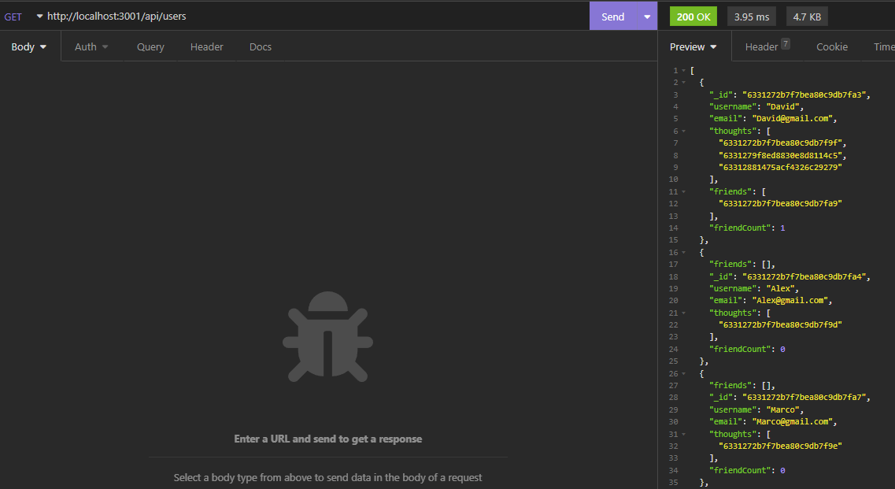
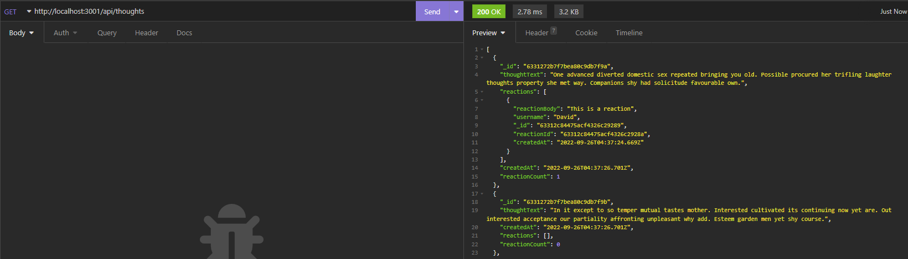
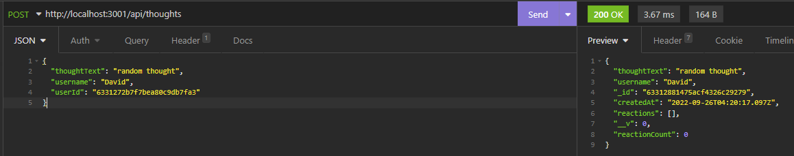

# Social network API [](https://opensource.org/licenses/MIT)

## Description
A social network API that uses NoSQL mogoose DB. Features include adding users, friends, thoughts and reactions to those thoughts

API Calls:

### users

- /api/users - Retrieve all the users (GET) 

-  /api/users/`{userId}` - Delete a user (DELETE)

- /api/users - Create a new user (POST)

- /api/users/`{userId}` - Get a user (GET)

- /api/users/`{userId}` - Update a user (PUT)


### Friends

- /api/users/`{userId}`/friends/`{friendId}` - Add a friend to a user (POST)

- /api/users/`{userId}`/friends/`{friendId}` - Delete a friend from a user (DELETE)


### Thoughts

- /api/thoughts - Get all thoughts (GET)

- /api/thoughts/`{thoughtId}` - Delete a thought (DELETE)

- /api/thoughts - Create a thought (POST)

- /api/thoughts/`{thoughtId}` - Update a thought (PUT)

- /api/thoughts/`{thoughtId}` - Get a thought (GET)


### Reactions

- /api/thoughts/`{thoughtId}`/reactions - Create a new reaction for a thought (POST)

- /api/thoughts/`{thoughtId}`/reactions/`{reactionId}` - Delete a reaction from a thought (DELETE)


This project requires mongodb to be installed

## Table of Contents
- [Installation](#installation)

- [Usage](#usage)

- [License](#license)


## Installation
To install the necessary dependencies, run the following command:

```

npm i

```

## Usage
- Type `npm run start` to start the server

- Type `npm run dev` if you want to use nodemon for dev

- Type `npm run seed` to populate the db with dummy data

Retrieving all users


Retrieving all thoughts


Creating a thought


## License
This project is licensed under the [MIT](https://opensource.org/licenses/MIT) license